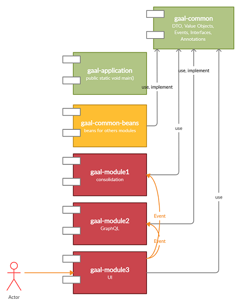
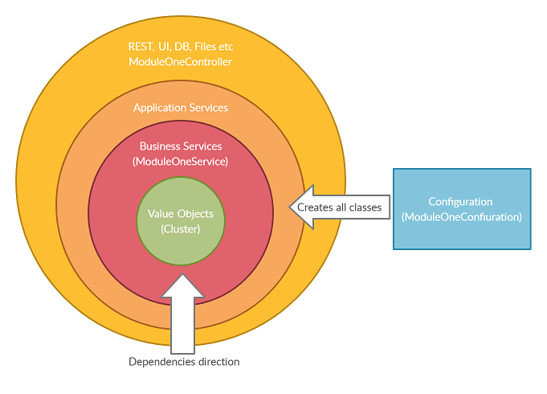

# GAAL

It is a POC project.
 
Modular monolith Architecture with strict Architecture boundaries. 
### Tech steck
- Java 11
- Spring Boot 2.1.9
- Gradle 6.7
- JUnit 5
- ArchUnit 0.14.1
- Lombok 1.18.10

### Key features

- Code dependencies direct to the most stable component _gaal-common_. It contains DTO, Value Objects, Interfaces, Events
- _gaal-common-beans_ contains beans (services) implementations, interfaces are in _gaal-common_
- _gaal-module1_ contains logic related to specific case (e.g. Consolidation). It is absolutely independent. 
   Module enabled by property _module-one.enable=true_ 
- _gaal-module2_ contains logic related to specific case (e.g. GraphQL). It is absolutely independent. 
   Module enabled by property _module-two.enable=true_ 
- _gaal-module3_ contains logic related to specific case, it this sample UI. It is absolutely independent. 
   Module enabled by property _module-three.enable=true_ 

Modules can send brodcast events with payload, and with this way interrogate with others modules. 
Modules also can contain custom implementations of interfaces from _gaal-common_ and these implementations 
can be used by others modules, but via the interface.  

Each module has similar architecture structure (as much as possible) and should follow onion model. 
 
